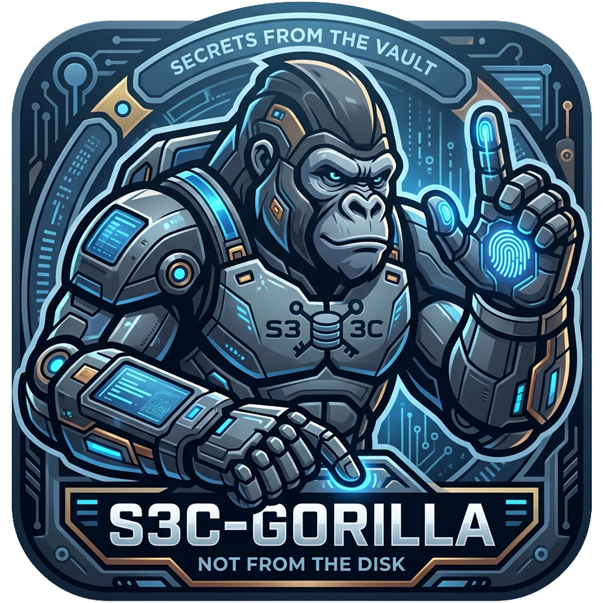

---

# s3c-gorilla

A `macOS toolkit` that wires everything together using best practices in a `secure` but still `convenient` way.

It puts every SSH key, `.env`, and 2FA code behind an encrypted vault and injects secrets into memory with TouchID (after entering master password at least once).

Built on top of `KeePassXC` password manager, `Apple TouchID`, `Apple Secure Enclave` chip.

> **macOS only.** Built for developers and security freaks.

---

## How it works

```
You login into macOS
  → You SSH or RUN project that needs secrets
    → You enter KeePassXC master password once 
      → ssh-gorilla, env-gorilla injects secrets in memory (niceeeee)
        → You SSH or RUN project again
          → TouchID is enough to inject secrets (sweeeet)
            → You log off OR reboot
              → Your secrets in memory are wiped
              → Your TouchID capability is disabled (secureeeee)
```

A biometry-gated SE key that encrypts *one secret at a time*, tied
to your current enrolled fingerprints, wiped on logout. A coerced
finger decrypts exactly the one blob the user was about to touch,
not the vault.

Works in `terminal`, auto-detects SSH sessions via `macOS daemon`.

> **No TouchID?** Voice-activated STT passphrase got you covered ;)

---

## Toolz

- **env-gorilla** — run any command with secrets injected from KeePassXC, pure memory
- **ssh-gorilla** — secure SSH via KeePassXC Agent, auto-unlock with TouchID (Secure Enclave with `chip-wrap` OR even more secure `SEKeys`)
- **otp-gorilla** — show and copy 2FA/TOTP codes from KeePassXC, TouchID powered
- **touchid-gorilla** — TouchID gate for your master password (Swift binary)

Extra:
- **VSCodium / VS Code** — sample config file to build with injected ENV variables  

---

## Security model — what we guarantee

- **Nothing in the clear on disk.** Every secret is SE-encrypted
  (biometry-gated, `.biometryCurrentSet`) before hitting `/tmp`.
  KeePass master password is never written to disk or any
  persistent cache.
- **Hardware-enforced per-decrypt TouchID.** Not a "cached"
  TouchID, not a grace period. Every blob decrypt requires a
  fresh fingerprint scan via the Secure Enclave.
- **Per-secret coercion scope.** One forced fingerprint = one
  secret exposed, not the vault.
- **Session boundaries actually work.** We wipe on reboot
  (unconditionally, at LaunchAgent startup), on logout (SIGTERM
  handler), on screen lock (configurable but default on), and on
  TTL expiry. Not best-effort — verified by two-layer checks.
- **Signed, hardened, and pinned.** Binaries are installed mode
  `0555` root-owned, signed with hardened runtime + timestamp,
  self-verify via `SecCodeCheckValidity` on startup, AND compare
  their own `cdhash` against an install-time pin. Swap the binary
  and the agent refuses to launch.
- **No core dumps, no swap leaks.** `RLIMIT_CORE = 0` on every
  binary that touches secrets. The bulk extraction buffer is
  `mlock()`'d — never paged to disk.

## And what we honestly do **not** protect against

Security-washing is worse than weak security. Here's what this
tool **cannot** save you from:

- **Physical coercion.** Someone holding your hand against the
  sensor gets what TouchID gates. Per-secret scope limits the
  blast radius; it doesn't eliminate it.
- **Same-uid code execution during the ~500ms fan-out window.**
  An attacker already running as your uid with debugger-attach
  entitlements can read the vault during the brief window when
  every secret is simultaneously live in the extraction process's
  memory. Hardened runtime raises the bar; it is not absolute.
- **A compromised host with an unlocked session.** If an attacker
  owns your account and the session is active, they can trigger
  TouchID prompts that you might reflexively approve. We narrow
  the blast radius per-secret, but we cannot stop you from
  approving a malicious prompt.
- **A compromised KeePassXC master password.** This tool is a
  better front door — it is not an entire threat model. Your
  kdbx still needs a strong master password and Argon2 KDF.

---

## Why this exists

**Problem I**
Your `~/.ssh/id_rsa`, your dozens of `.env` files scattered across `~/Projects/`, your authenticator app on a phone you might lose — each one is a footgun. A stolen laptop, a backup sync to the wrong place, a local LLM agent running wild with filesystem access, and the damage is done.

**Problem II**
I don't trust `Apple` nor `Apple Keychain` nor `Apple Passwords` because:
- it can be confiscated from me remotely/physically
- it can be easily unlocked with TouchID / Face ID with physical force or remotely, therefore it's not secure at all

BUT 
- I like the `convenience` of it
- I also like the `security` that Apple's `Secure Enclave` chip provides

---

## What it does

- **SSH keys live in your KeePassXC database.** No `id_rsa` on
  disk. Our signed SSH agent (runs as a LaunchAgent, so GUI tools
  like SourceTree and VS Code work natively) signs with the key
  only at the moment you `ssh somehost` — one TouchID per sign.
- **Per-project `.env` injection at runtime.** `env-gorilla proj
  -- npm run dev` pulls the `.env` out of kdbx straight into the
  child process's memory. Never writes to disk. Never exports to
  the parent shell. Can't be read by `cat`, `grep`, or a
  compromised editor.
- **TOTP codes from the same vault.** `otp-gorilla github` prints
  the 6-digit code, copies to clipboard, fires a native notification.
  Replaces Google Authenticator on a phone you might lose.
- **Session-bound.** Reboot, logout, screen lock, or 2 hours idle
  — blobs are wiped, next tool call re-prompts the master password.
- **One master password per session. Fan-out does the rest.**
  First tool call extracts every vault secret into its own
  chip-wrapped blob. Subsequent calls = one TouchID per secret.
  Typing the master password ten times per day is the UX friction
  that gets people to disable security; we type it once.
- **An umbrella CLI (`s3c-gorilla`) that audits your exposure.**
  Scans your filesystem for plaintext `.env` files, audits
  `~/.ssh/` for unencrypted private keys, greps git history for
  leaked API keys, and offers to migrate leftover credentials out
  of the Apple Keychain into the vault.

---

## At a glance

```bash
# SSH: your key is in the vault. First sign per session prompts
# master pw; every one after is a single TouchID.
ssh prod.example.com

# Run any command with per-project .env secrets injected at runtime.
# Nothing written to disk, nothing exported to your shell.
env-gorilla myapi -- npm run dev

# 2FA codes from the same vault. Copies to clipboard, fires a
# macOS notification. Replaces Google Authenticator on your phone.
otp-gorilla github

# The umbrella CLI — status, health, audits.
s3c-gorilla status              # agent PID, TTL remaining, config paths
s3c-gorilla doctor              # full integrity check (codesign, modes, deps, hw)
s3c-gorilla scan --all          # sweep filesystem + ~/.ssh + git history for leaks
s3c-gorilla keychain check      # what's in Keychain that should be in kdbx?
s3c-gorilla wipe                # force session kill before handing off the laptop
```

Every command has `-h` for full usage; see
[docs/02-DOCUMENTATION.md](docs/02-DOCUMENTATION.md) for the
complete reference.

---

## The suite

| Tool | What it does |
|---|---|
| `s3c-gorilla` | Umbrella CLI — `status`, `doctor`, `scan`, `keychain` migration, `wipe`. |
| `touchid-gorilla` | The SE primitive — wrap / unwrap / fan-out session bootstrap. Swift. |
| `env-gorilla` | Injects kdbx `.env` attachments into a child process's memory. |
| `otp-gorilla` | TOTP code viewer + clipboard copy + macOS notification. |
| `ssh-gorilla.sh` | Thin `ssh` wrapper (hostname shortcuts). |
| `s3c-ssh-agent` | Drop-in SSH agent (LaunchAgent) backed by the Secure Enclave. Works with SourceTree, VS Code, IntelliJ, plain `ssh`. |


---

## Install

One-liner:

```bash
bash <(curl -fsSL https://raw.githubusercontent.com/RussianRoulette84/s3c-gorilla/master/src/install.sh)
```

**Prefer to inspect before running?** Recommended for a tool that touches your secrets.

```bash
git clone https://github.com/RussianRoulette84/s3c-gorilla.git
cd s3c-gorilla
less src/install.sh          # read first, then:
./src/install.sh
```

The installer needs `sudo` once (binaries land in `/usr/local/bin`
as root-owned, mode 0555). It auto-detects TouchID hardware,
pulls `keepassxc-cli` + `terminal-notifier` via Homebrew if
missing, and walks you through KeePassXC database picking, SSH
mode (chip-wrap your existing key vs chip-generate a new one),
and screen-lock paranoia level.

See [docs/01-SETUP_GUIDE.md](docs/01-SETUP_GUIDE.md) for the
first-time KeePassXC setup.

## Requirements

- **macOS 12 (Monterey) or later.** No Linux support. No Windows
  support. macOS is required — we depend on the Secure Enclave,
  LaunchAgents, and Apple's Security framework.
- **TouchID strongly recommended.** Fallback path exists for
  Mac mini / Mac Pro without sensors (manual master password
  prompt on every tool call OR voice-gorilla — still works, less ergonomic).
- **KeePassXC 2.7+.** `brew install --cask keepassxc`.
- **A signing identity for the Swift binaries.** Developer ID
  Application cert recommended; the installer walks you through
  picking one.
- **Homebrew.** `brew` is assumed for `keepassxc-cli` and
  `terminal-notifier`.

## Going deeper

- [docs/02-DOCUMENTATION.md](docs/02-DOCUMENTATION.md) — full
  command reference, config knobs, file layout, troubleshooting.
- [docs/03-SETUP_KEYBOARD_MAESTRO.md](docs/03-SETUP_KEYBOARD_MAESTRO.md) —
  optional Keyboard Maestro macros for global OTP paste.
- [plan/PLAN.md](plan/PLAN.md) — internal implementation spec,
  threat model detail, 43 resolved security concerns.

---

## Extra

Running `Claude Code`, `OpenCode` LLMs on your local machine is an even crazier thing to do! 
You risk *data loss*, give away your *private data*, you have *zero sandbox* and your *explosion radius* is huge.

That's why I created: 
- 

BUT sometimes you are forced to run AI locally to get the latest features that only `Claude.app` can do. Or run a small tasks with OpenCode or VSCodium's Claude Code.

So we are still not 100% AI free locally. That's why I created: 
- 

Check it out ;)

## Tested on

- **macOS** 15.7.1 (24G231), Apple Silicon (arm64)
- **Swift** 6.2 (swiftlang-6.2.0.19.9, clang-1700.3.19.1)
- **KeePassXC** 2.7.12 (Homebrew, `/opt/homebrew/bin/keepassxc-cli`)
- **terminal-notifier** 2.0.0
- **git** 2.53.0
- **Xcode Command Line Tools** (xcrun 72)

Older macOS (12 Monterey / 13 Ventura / 14 Sonoma) and Intel Macs
should work — the dependencies are all macOS 12+ APIs. If you run
into a version-specific issue, open an issue with the output of
`sw_vers && swift --version && keepassxc-cli --version`.

## License

MIT — Copyright (c) 2026 Slav IT
